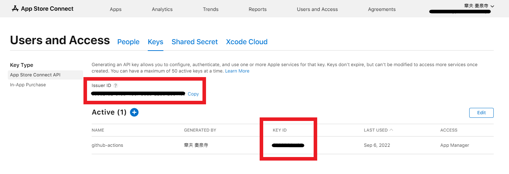

# publish-testflight-github-action

ipa ファイルを TestFlight に配信する GitHub Action です。

## Requirement

### fastlane

You will need to install [fastlane](https://docs.fastlane.tools/).

```sh
brew install fastlane
```

## API Key

An API key is a value required to use the App Store Connect API.
This key can be created at [App Store Connect](https://appstoreconnect.apple.com/access/api).



## Arguments

|Name|Required|Type|Default|Description|
|:--|:--|:--|:--|:--|
|`api-key`|`false`|`string`||The App Connect API Key. If `api-key-path` is not specified, this value must be specified, but if `api-key-path` is specified and this value is set, the contents of `api-key-path` will be overwritten with this value.|
|`api-key-path`|`false`|`string`||The App Connect API Key path. If `api-key` is not specified, this value must be specified.|
|`ipa-path`|`true`|`string`||Path to the IPA file to be delivered by TestFlight.|
|`issuer-id`|`true`|`string`||Issuer ID|
|`key-id`|`true`|`string`||Key ID|

## License

Any contributions made under this project will be governed by the [MIT License](https://github.com/akiojin/publish-testflight-github-action/blob/main/LICENSE).

